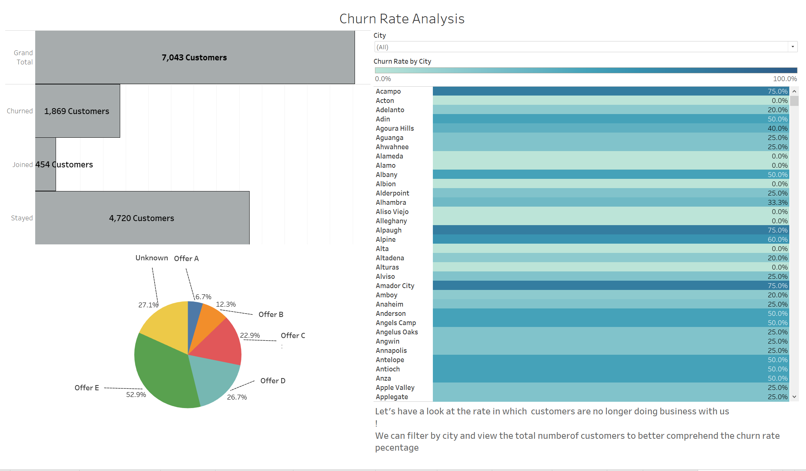
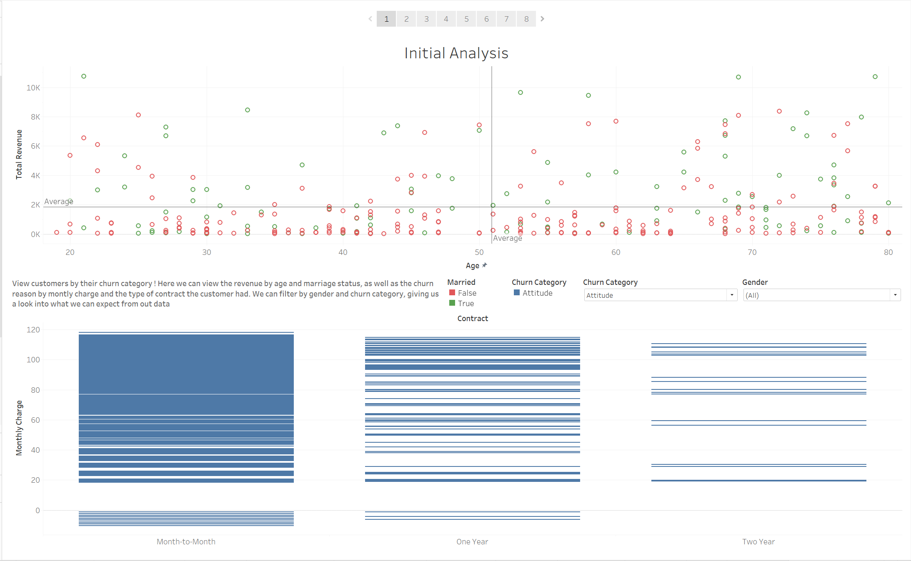
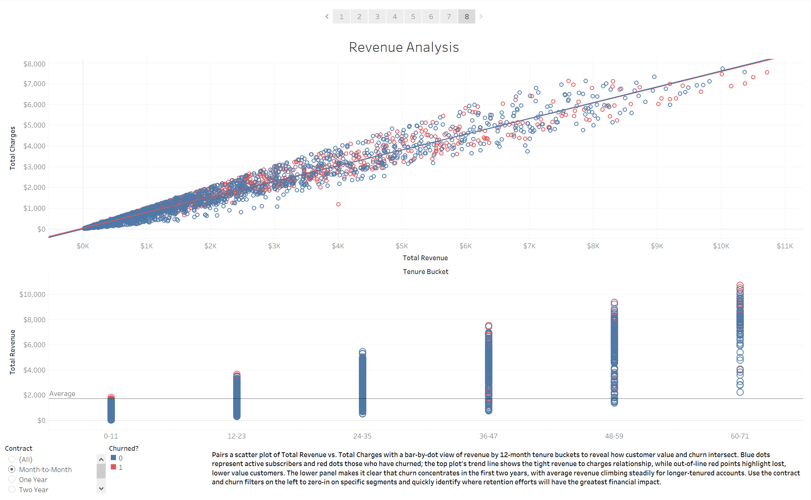
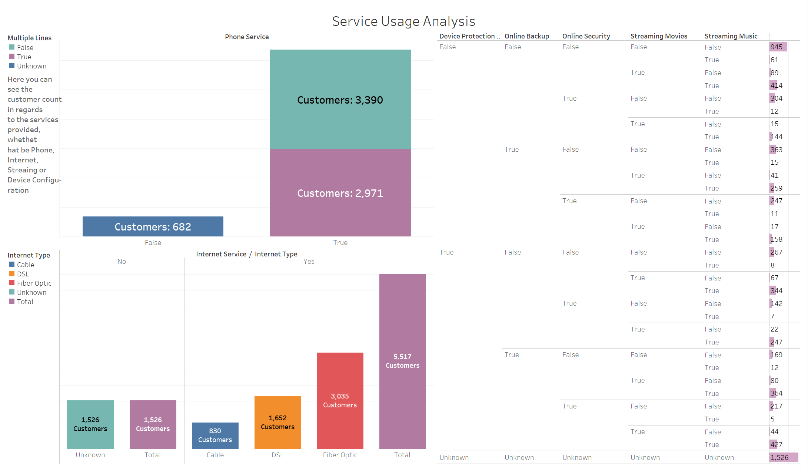
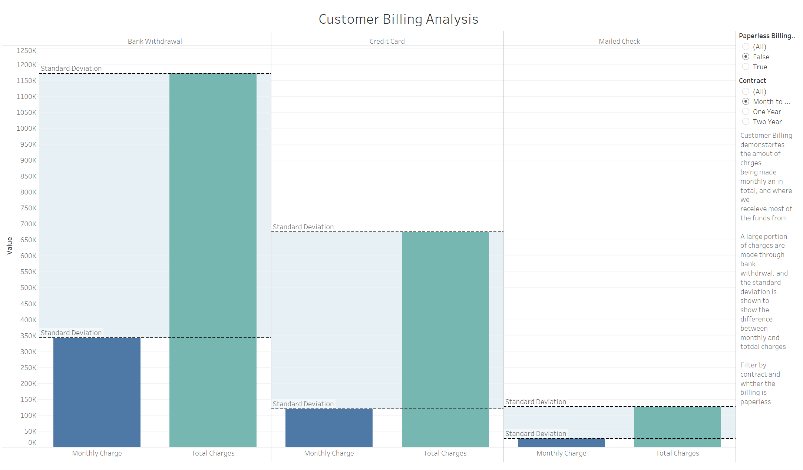
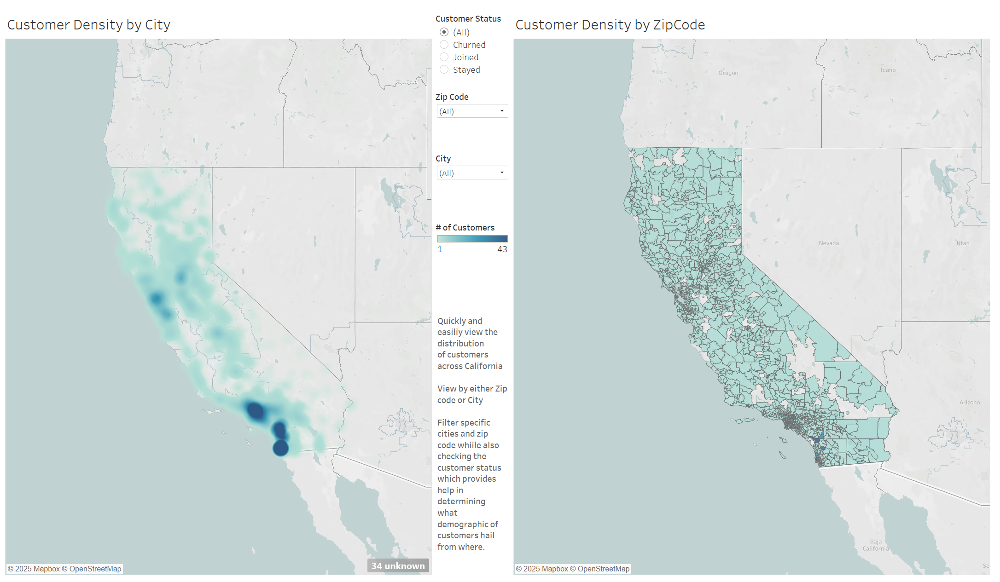
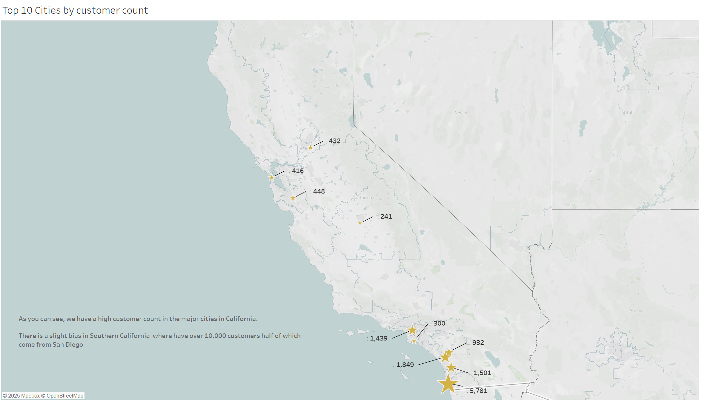
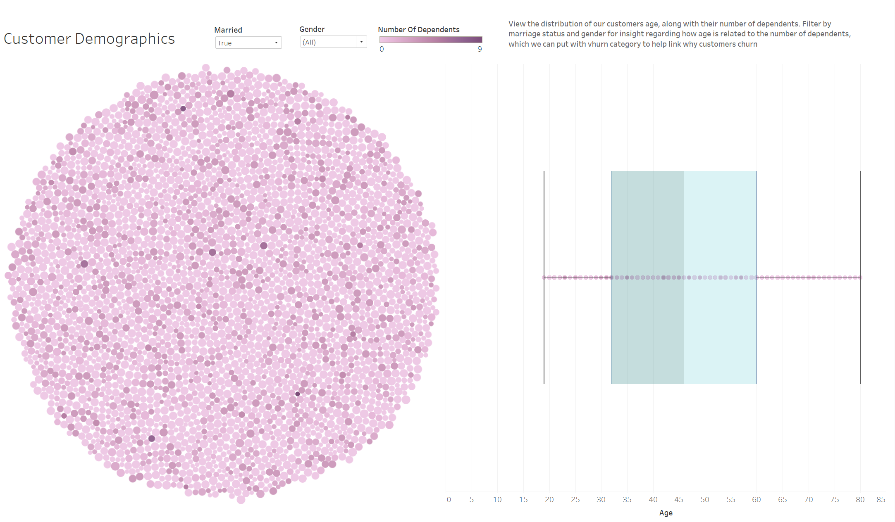

# Telecom Customer Churn Analysis Dashboard

**Project Type:** Data Analysis / Business Intelligence  
**Tools Used:** Python (Pandas), Data Cleaning, Feature Engineering, Tableau  
**Dataset Size:** 7,043 Customers  

---

## Project Overview

Customer churn directly impacts revenue, growth, and long-term business sustainability.  
This project analyzes a telecom customer dataset to uncover key drivers of churn, revenue impact, service usage behavior, and geographic distribution.

The workflow includes:

- Data preprocessing and cleaning in Python
- Feature engineering (tenure buckets, standardized labels)
- Interactive dashboard creation
- Business insight generation and recommendations

---

## Data Preprocessing

Preprocessing was performed in `Pre-Proccessing.ipynb` and included:

- Handling missing and “Unknown” values
- Standardizing churn labels (Churned / Stayed / Joined)
- Creating tenure buckets (0–11, 12–23, etc.)
- Cleaning revenue and billing fields
- Preparing categorical fields for dashboard filtering
- Integrating zipcode population data for geographic analysis

Final working dataset: **7,043 customers**

---

# Dashboard Sections & Key Findings

---

## Churn Overview

- **Total Customers:** 7,043  
- **Churned:** 1,869  
- **Stayed:** 4,720  
- **Joined:** 454  

 **Overall churn rate ≈ 26.5%**

More than one-quarter of customers have left, representing a significant revenue impact.

---

## Contract Type Analysis

Month to Month customers show significantly higher churn compared to:

- One-Year contracts  
- Two-Year contracts  

 **Key Insight:**  
Longer contracts strongly correlate with improved retention.

**Business Implication:**  
Incentivizing annual or multi year contracts could reduce churn risk.

---

##  Revenue & Tenure Analysis

Key observations:

- Strong linear relationship between Total Revenue and Total Charges
- Revenue increases steadily with tenure
- Churned customers cluster heavily in early tenure buckets

 **Critical Finding:**  
Churn is concentrated in the **first 12–24 months**.

This early period represents the highest financial risk and greatest opportunity for retention efforts.

---

## Service Usage Analysis

Service comparison reveals:

- Customers without Online Security and Device Protection show higher churn
- Fiber Optic users represent a large portion of the base
- Internet services strongly influence churn segmentation

**Insight:**  
Bundling protection/security services may improve customer retention.

---

##  Billing & Payment Behavior

Findings include:

- Most revenue is collected via Bank Withdrawal
- Month-to-Month + paperless billing customers show higher churn tendencies
- Standard deviation in charges suggests volatility among churn segments

**Insight:**  
Flexible billing models may attract short-term customers but increase churn risk.

---

## Geographic Distribution

### Customer Density by City & Zip Code

### Top 10 Cities by Customer Count

Findings:

- Strong customer concentration in Southern California
- Churn rates vary by city
- Certain metropolitan areas show higher density and revenue potential

**Insight:**  
Geographic segmentation enables targeted retention campaigns.

---

## Customer Demographics

- Majority of customers fall between ages 30–60
- Dependents and marital status influence churn patterns
- Age and tenure show meaningful revenue progression

**Insight:**  
Demographic segmentation can enhance predictive churn modeling.

---

